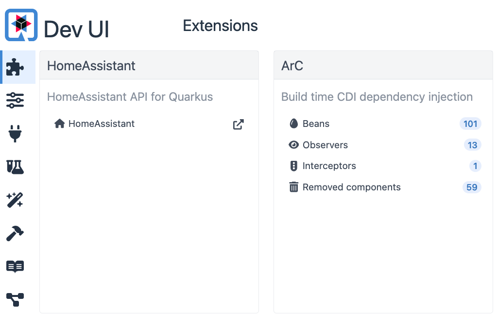
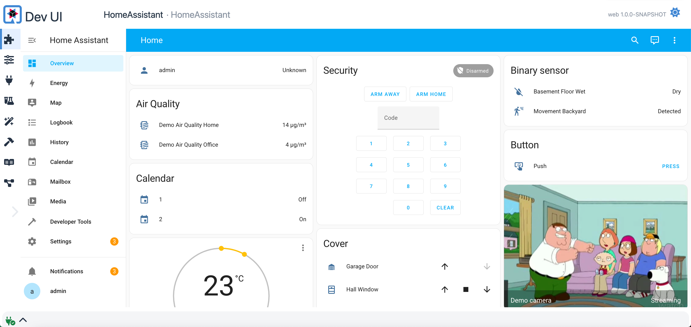

# Quarkus HomeAssistant

[](https://search.maven.org/artifact/io.quarkiverse.homeassistant/quarkus-homeassistant)

This extension allows you to interact with [Home Assistant](https://www.home-assistant.io/) from Quarkus applications.


## Work-in-progress

This extension is currently a work-in-progress and although it is functional, expect its API's and approach to change as we refine it.

## Features

Below are the features that are currently available and planned for this extension:

## Home Assistant REST API client. 

```java
    @Inject
    IHAContext ha;

    void doStuff() {
        ha.getApi().getStates().forEach(System.out::println);
    }
``` 

## Home Assistant WebSocket API client

Currently using the undertow based Jakarta WebSocket API but will switch to the Quarkus WebSocket.next API to make it
much more straight forward.

For now only basic event handling is supported. Uses CDI type-safe event observers to listen to events.

```java
    @Inject
    IHAContext ha;

    void onStart(@Observes StartupEvent ev) throws DeploymentException, IOException {               
        ha.ws().connect();
    }

   void onStateChanged(@ObservesAsync GenericEvent ge) {
        Log.info("Generic event " + ge.getNode().toPrettyString());
    }

    void onStateChanged(@ObservesAsync StateChangeEvent ev) {
        Log.info("state changed! " + ev.event.toPrettyString());
    }
```

## Home Assistant DevService

If no configuration is provided, a HomeAssistant demo instance is setup for you as a devservice.

Username: `admin`, password: `secret`.

Available in dev-ui as a tile:



and embedded in the dev-ui:



## Inject of Home Assistant entities (Not yet implemented)

Generic and Type-safe injection of Home Assistant entities as CDI beans.

```java
    @Inject
    @HassEntity("light.kitchen")
    Entity kitchenLight;

    void doStuff() {
        kitchenLight.turnOn();
    }
```

## Async-friendly API (Not yet implemented)

```java

    @Inject Home home;

    void listen() {
         kitchenLightl.stateChanges().when(l -> l.isOn()).do(...)
    }
```

## Code Generator for completion and type-safe API (Not yet implemented)

```java
    @Inject 
    Andersens home;

    @Inject
    KitchenMotion motion;

    void setup() {
        motion.stateChanges()   
                .when(e->e.newState().isOn())
                .subscribe(x -> home.entities().lights().office().turnOn()) 
        };
    }
```

## Samples

Check out the [samples](samples/web) directory for examples on how to use this extension.

There is a [cli](samples/cli) directory that has early version of experiment. Eventually will move that to actually 
use the extension.

## Getting Started 

To incorporate Quarkus HomeAssistant into your Quarkus project, add the following Maven dependency:

```xml
<dependency>
    <groupId>io.quarkiverse.homeassistant</groupId>
    <artifactId>quarkus-homeassistant</artifactId>
    <version>{latest-version}</version>
</dependency>
```

Make sure to replace `{latest-version}` with the most recent release version available on [Maven Central](https://search.maven.org/artifact/io.quarkiverse.homeassistant/quarkus-homeassistant).


## Inspiration

Inspired by netDaemon that allows you to write .NET applications that interact with Home Assistant in a similar type-safe fashion. 

## Contributing

Feel free to contribute to this project by submitting issues or pull requests.

## License

This project is licensed under the Apache License 2.0 - see the [LICENSE](LICENSE) file for details.

